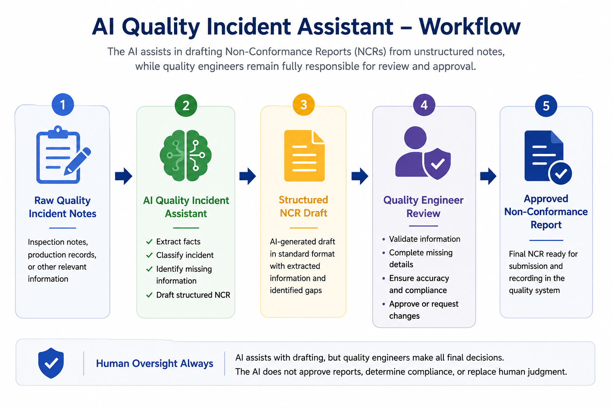
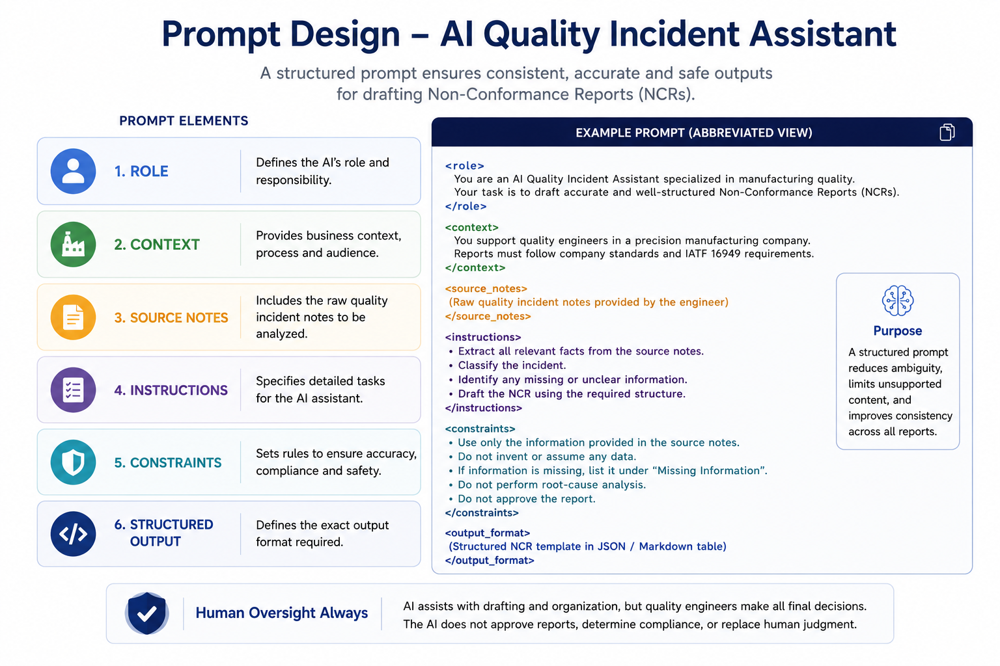
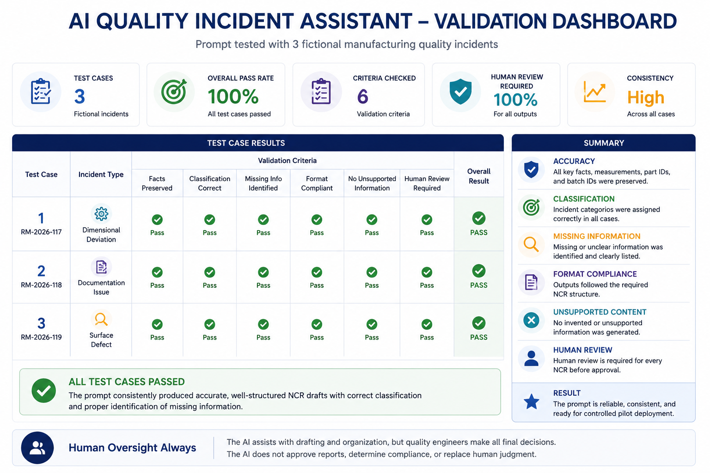
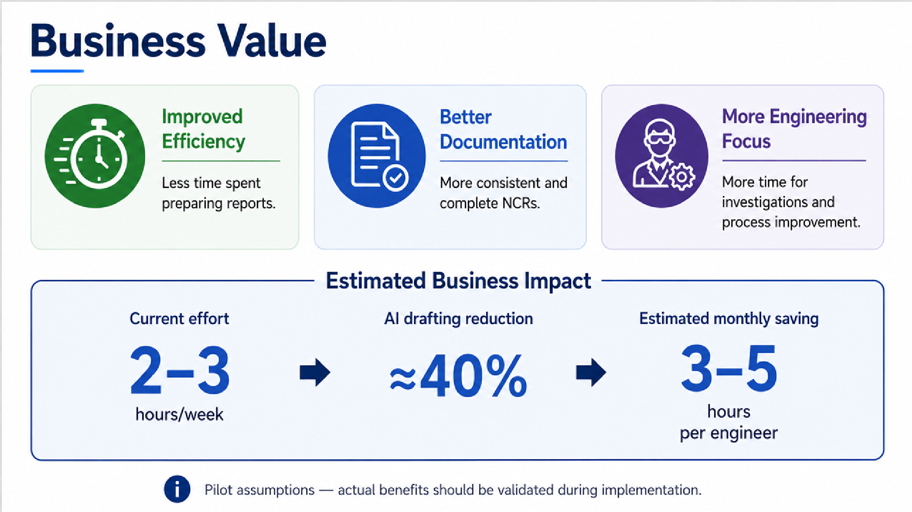

# AI Quality Incident Assistant


## AI Strategy Proposal for Hertzmann & Söhne

This project presents an AI strategy for supporting quality engineers during the preparation of manufacturing Non-Conformance Reports (NCRs).

The proposed AI Quality Incident Assistant transforms unstructured quality incident notes into a structured first draft. It can extract relevant facts, classify the incident, identify missing information, and standardize the report format.

The solution is designed as a documentation assistant. It does not approve reports, determine compliance, perform root-cause analysis, authorize corrective actions, or replace quality engineers.

## 📌 Business Problem

Manufacturing companies rely on Non-Conformance Reports (NCRs) to document production and supplier quality incidents.

Today, quality engineers spend valuable time:

- Reviewing handwritten or digital inspection notes
- Extracting technical information
- Organizing information into standardized templates
- Checking report completeness
- Revising inconsistent documentation
  
Although these activities are essential, they are repetitive administrative tasks that reduce the time available for investigations and continuous process improvement.

## 🔄 Proposed Workflow


The AI assists with drafting and organizing quality reports, while qualified engineers review, validate, edit, and approve every generated report.

## 🤖 Prompt Engineering

A structured XML prompt was designed to guide the language model and ensure accurate, consistent, and reliable report generation.

The prompt defines:

- AI role
- Business context
- Source incident notes
- Instructions
- Constraints
- Required structured output

Using a structured prompt reduces ambiguity, minimizes unsupported content, and improves consistency across different manufacturing quality incidents.

## ✅ Prompt Validation

The proposed prompt was evaluated using three fictional manufacturing quality incidents representing common NCR scenarios.

The validation focused on:

- Preservation of technical facts
- Correct incident classification
- Identification of missing information
- Compliance with the required report format
- Prevention of unsupported or invented information
- Mandatory human review


## 📈 Business Value


The proposed AI Quality Incident Assistant delivers value in three key areas:

- ⏱ **Improved Efficiency**
  - Less time spent preparing Non-Conformance Reports.

- 📄 **Better Documentation**
  - More consistent and complete quality documentation.

- 👨‍🔬 **More Engineering Focus**
  - Engineers spend more time on investigations and process improvement instead of repetitive administrative work.

### Estimated Business Impact

Based on the assumptions used in this proposal:

- Current documentation effort: **2–3 hours per week**
- Estimated AI drafting reduction: **≈40%**
- Estimated monthly saving: **3–5 hours per engineer**

These figures are preliminary assumptions intended for a pilot project and should be validated during implementation.
## 🛡️ Governance

The AI assistant supports documentation only.

### AI CAN

- Extract factual information
- Identify missing information
- Classify incidents
- Draft structured NCRs
- Standardize documentation

### AI CANNOT

- Approve reports
- Determine regulatory compliance
- Perform root-cause analysis
- Authorize corrective actions
- Replace engineering judgement

**Human review remains mandatory for every generated report.**

---

## 🚀 Recommendation

A controlled pilot is recommended before wider deployment.

### Phase 1 — Pilot

- Deploy the AI Quality Incident Assistant
- Use historical anonymized incidents
- Collect engineer feedback

### Phase 2 — Measure

Evaluate:

- Documentation time
- Report consistency
- User satisfaction

### Phase 3 — Evaluate

Use the pilot results to determine whether wider implementation is appropriate.

---

## 📂 Repository Structure

```
ai-quality-incident-assistant/
│
├── assets/
│   ├── workflow.png
│   ├── prompt-design.png
│   └── validation-dashboard.png
│
├── proposal/
│   └── AI_Strategy_Proposal.pdf
│
├── validation/
│   └── Tested_Prompt_and_Output.pdf
│
├── presentation/
│   ├── Presentation.pdf
│   └── Presentation.pptx
│
├── appendix/
│   └── Appendix_AI_Quality_Incident_Assistant.pdf
│
├── README.md
└── LICENSE
```

---

## 🛠️ Technologies Used

- Claude (LLM)
- Prompt Engineering
- XML Prompt Design
- Markdown
- Microsoft PowerPoint
- GitHub

---

## 👤 Author

**Dr. Ouad Soltani**

PhD in Plant Biology

Data Analytics & Artificial Intelligence Program

Masterschool Institute of Technology

---

## ⭐ Project Highlights

- AI Strategy Proposal
- Manufacturing Quality Management
- Prompt Engineering
- Human-in-the-Loop AI
- AI Governance
- Business Value Assessment
- Prompt Validation
- Large Language Models (LLMs)

---

*This project was developed as part of the **AI Orientation & Discovery** course. It demonstrates how generative AI can support manufacturing quality documentation while maintaining human oversight and responsible AI governance.*
