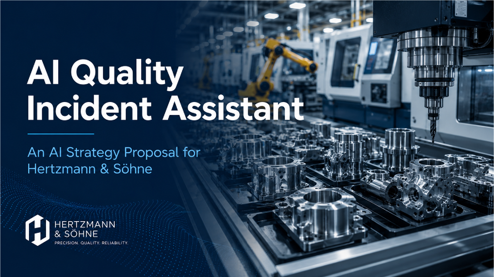

# AI Quality Incident Assistant

## AI Strategy Proposal for Hertzmann & Söhne

This project presents an AI strategy for supporting quality engineers during the preparation of manufacturing Non-Conformance Reports (NCRs).

The proposed AI Quality Incident Assistant transforms unstructured quality incident notes into a structured first draft. It can extract relevant facts, classify the incident, identify missing information, and standardize the report format.

The solution is designed as a documentation assistant. It does not approve reports, determine compliance, perform root-cause analysis, authorize corrective actions, or replace quality engineers.

## Business Problem

Quality engineers regularly prepare Non-Conformance Reports from inspection notes and production records.

The current process involves:

- manually extracting technical information;
- organizing information into standardized templates;
- checking whether required information is missing;
- revising inconsistent report structures;
- preparing documentation for approval.

This repetitive administrative work reduces the time available for investigations and process improvement.

## Proposed Workflow

```text
Raw Quality Incident Notes
            ↓
AI Quality Incident Assistant
            ↓
Extract Facts
Classify Incident
Identify Missing Information
Draft Structured NCR
            ↓
Quality Engineer Review
            ↓
Approved Non-Conformance Report
